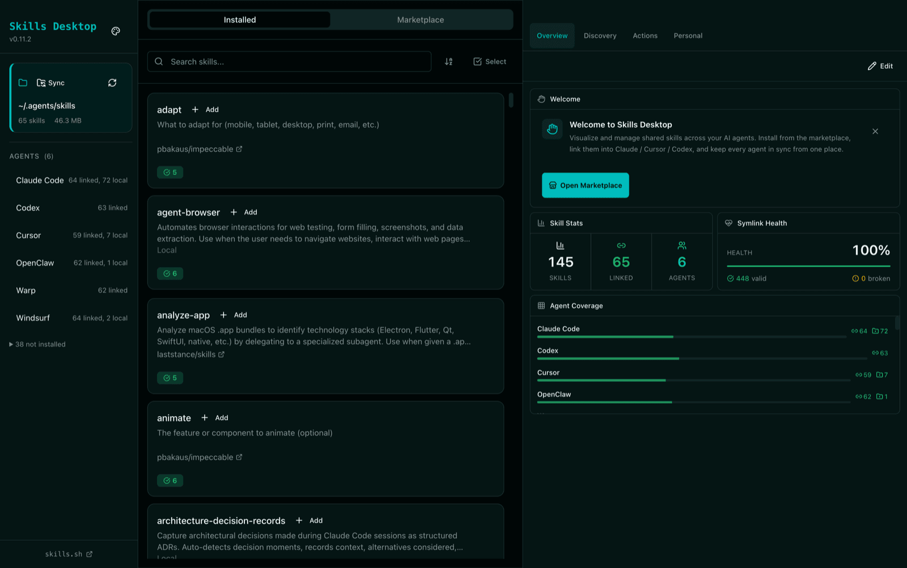

# Skills Desktop

> Visualize installed Skills and symlink status across AI agents

[](https://opensource.org/licenses/MIT)
[](https://www.apple.com/macos/)

<p align="center">
  
</p>

Skills Desktop provides a GUI to manage and monitor skills installed via [`npx skills add <owner/repo>`](https://github.com/vercel-labs/skills). It displays the central skill repository (`~/.agents/skills/`) and shows symlink status for each supported AI agent.

## Features

- **21 AI Agents Supported** - Auto-detects Claude Code, Cursor, Codex, Gemini CLI, and more
- **Symlink Status Visualization** - Valid (✓), Broken (◐), Missing (○) indicators
- **26 Themes** - 24 OKLCH color themes + 2 shadcn/ui neutral themes
- **Auto Update** - Automatic updates via GitHub Releases

## Supported Agents

| Agent            | Path                        |
| ---------------- | --------------------------- |
| Claude Code      | `~/.claude/skills/`         |
| Cursor           | `~/.cursor/skills/`         |
| OpenAI Codex     | `~/.codex/skills/`          |
| Gemini CLI       | `~/.gemini/skills/`         |
| GitHub Copilot   | `~/.github-copilot/skills/` |
| Cline            | `~/.cline/skills/`          |
| Roo Code         | `~/.roo-code/skills/`       |
| Aider            | `~/.aider/skills/`          |
| Windsurf         | `~/.codeium/skills/`        |
| Zed              | `~/.zed/skills/`            |
| Continue         | `~/.continue/skills/`       |
| _...and 10 more_ |                             |

## Installation

Download the latest release from [GitHub Releases](https://github.com/laststance/skills-desktop/releases).

| Architecture             | Download                         |
| ------------------------ | -------------------------------- |
| Apple Silicon (M1/M2/M3) | `skills-desktop-x.x.x-arm64.dmg` |
| Intel Mac                | `skills-desktop-x.x.x-x64.dmg`   |

## Development

### Prerequisites

- Node.js 20+
- pnpm 9+

### Setup

```bash
# Install dependencies
pnpm install

# Start development
pnpm dev

# Type check
pnpm typecheck

# Lint
pnpm lint
```

### Build

```bash
# Build for macOS (requires code signing)
APPLE_KEYCHAIN_PROFILE=skills-desktop pnpm build:mac
```

## Tech Stack

| Component | Technology                                           |
| --------- | ---------------------------------------------------- |
| Framework | Electron 34                                          |
| Frontend  | React 19 + TypeScript                                |
| State     | Redux Toolkit + @laststance/redux-storage-middleware |
| Styling   | Tailwind CSS + shadcn/ui                             |
| Build     | electron-vite                                        |

## Project Structure

```
src/
├── main/           # Electron main process
├── preload/        # Context bridge (IPC)
├── renderer/       # React frontend
└── shared/         # Shared types
```

## Related

- [Skills CLI](https://github.com/vercel-labs/skills) - Install skills via CLI
- [Skills Registry](https://skills.sh) - Browse available skills
- [Agent Skills Spec](https://agentskills.io) - Skills specification

## License

MIT - [Laststance.io](https://github.com/laststance)
