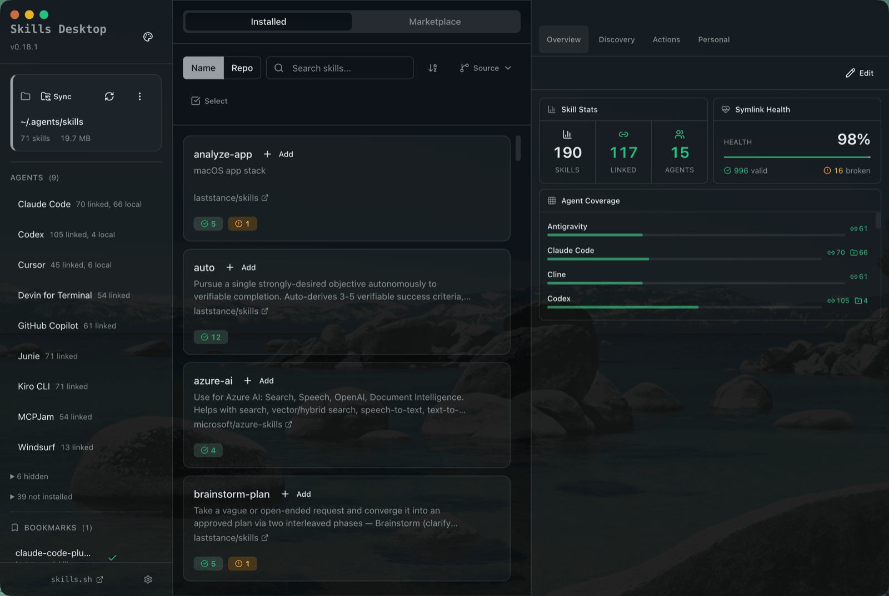

# Skills Desktop

> Visualize installed Skills and symlink status across AI agents

[](https://opensource.org/licenses/MIT)
[](https://www.apple.com/macos/)
[](https://codecov.io/gh/laststance/skills-desktop)
[](SECURITY.md)
[](https://deepwiki.com/laststance/skills-desktop)

<p align="center">
  
</p>

Skills Desktop provides a GUI to manage and monitor skills installed via [`npx skills add <owner/repo>`](https://github.com/vercel-labs/skills). It displays the central skill repository (`~/.agents/skills/`) and shows symlink status for each supported AI agent.

## Features

- **69 AI Agents Supported** - Auto-detects Claude Code, Cursor, Codex, Gemini CLI, and more
- **Symlink Status Visualization** - Valid (✓), Broken (◐), Inaccessible (!), Missing (○) indicators
- **Customizable Dashboard** - Widget-based home view with skill stats, symlink health, agent coverage, bookmarks, and quick actions — drag, resize, and arrange across multiple pages
- **54 Themes** - 34 OKLCH color themes (17 hues × light/dark) + 2 pure neutral + 18 tinted neutral
- **Auto Update** - Automatic updates via GitHub Releases

## Supported Agents

| Agent            | Path                          |
| ---------------- | ----------------------------- |
| Claude Code      | `~/.claude/skills/`           |
| Cursor           | `~/.cursor/skills/`           |
| OpenAI Codex     | `~/.codex/skills/`            |
| Gemini CLI       | `~/.gemini/skills/`           |
| GitHub Copilot   | `~/.copilot/skills/`          |
| Cline            | `~/.cline/skills/`            |
| Roo Code         | `~/.roo/skills/`              |
| Junie            | `~/.junie/skills/`            |
| Devin Desktop    | `~/.codeium/windsurf/skills/` |
| OpenCode         | `~/.config/opencode/skills/`  |
| Continue         | `~/.continue/skills/`         |
| _...and 58 more_ |                               |

## Installation

Download the latest release from [GitHub Releases](https://github.com/laststance/skills-desktop/releases).

| Architecture             | Download                         |
| ------------------------ | -------------------------------- |
| Apple Silicon (M1/M2/M3) | `skills-desktop-x.x.x-arm64.dmg` |
| Intel Mac                | `skills-desktop-x.x.x-x64.dmg`   |

## Security

Please report vulnerabilities through the process described in
[SECURITY.md](SECURITY.md), not through public issues.

Skills Desktop keeps local filesystem access behind Electron preload IPC. The
main and settings windows use sandboxed, context-isolated renderers with Node.js
integration disabled. Main-process handlers validate IPC arguments, restrict
file reads to known skills directories, restrict external links to http(s), and
allow marketplace webviews only from the expected skills.sh origin.

macOS releases are built with Developer ID signing, notarization, and the
hardened runtime enabled. The security posture tracked for
[issue #241](https://github.com/laststance/skills-desktop/issues/241) includes
CodeQL, dependency review, production dependency audit, GitHub secret scanning,
Dependabot security updates, least-privilege Actions permissions, and branch
protection.

## Development

### Prerequisites

- Node.js 20+
- pnpm 11+

### Setup

```bash
# Install dependencies
pnpm install

# Start development
pnpm dev

# Type check
pnpm typecheck

# Lint
pnpm lint
```

### Testing

```bash
# Unit + browser tests (Vitest)
pnpm test

# E2E tests (Playwright Electron, macOS only)
pnpm test:e2e
```

| Suite | Command         | Runner                                                                     |
| ----- | --------------- | -------------------------------------------------------------------------- |
| Unit  | `pnpm test`     | Vitest (Node + browser mode via `*.browser.test.tsx`)                      |
| E2E   | `pnpm test:e2e` | Playwright Electron — boots the real app per spec, isolated HOME each test |

E2E specs live in `e2e/spec/*.e2e.ts`. The suite uses `cp -al` hardlink snapshots so each test starts from a fresh, populated `~/.agents/skills/` without re-running the skills CLI installer (~50 ms reset). CI runs on `macos-latest` (`.github/workflows/e2e.yml`); failures upload `playwright-report/` and `test-results/` as artifacts (traces + videos retained on failure).

> **⚠️ Hardlink caveat for spec authors.** Hardlinked files share inodes
> across every working HOME, so in-place edits (`writeFileSync` over an
> existing `SKILL.md`, `appendFileSync`, etc.) corrupt the snapshot for
> every subsequent test. Safe ops only: `unlink`, `rmdir`, `mkdir` +
> `writeFile` of NEW paths. See `e2e/fixtures/isolated-home.ts:82-85`
> for the canonical safe-ops list.

### Build

```bash
# Build for macOS (requires code signing)
APPLE_KEYCHAIN_PROFILE=skills-desktop pnpm build:mac

# Verify that the packaged window reaches the native compositor (requires Screen Recording)
pnpm test:release:macos-window
```

## Tech Stack

| Component | Technology                                           |
| --------- | ---------------------------------------------------- |
| Framework | Electron 43                                          |
| Frontend  | React 19 + TypeScript                                |
| State     | Redux Toolkit + @laststance/redux-storage-middleware |
| Styling   | Tailwind CSS + shadcn/ui                             |
| Build     | electron-vite                                        |

## Project Structure

```
src/
├── main/           # Electron main process
├── preload/        # Context bridge (IPC)
├── renderer/       # React frontend
└── shared/         # Shared types
```

## Related

- [Skills CLI](https://github.com/vercel-labs/skills) - Install skills via CLI
- [Skills Registry](https://skills.sh) - Browse available skills
- [Skills宝](https://skilery.com) - Chinese search and install hub for skills
- [Agent Skills Spec](https://agentskills.io) - Skills specification

## License

MIT - [Laststance.io](https://github.com/laststance)
