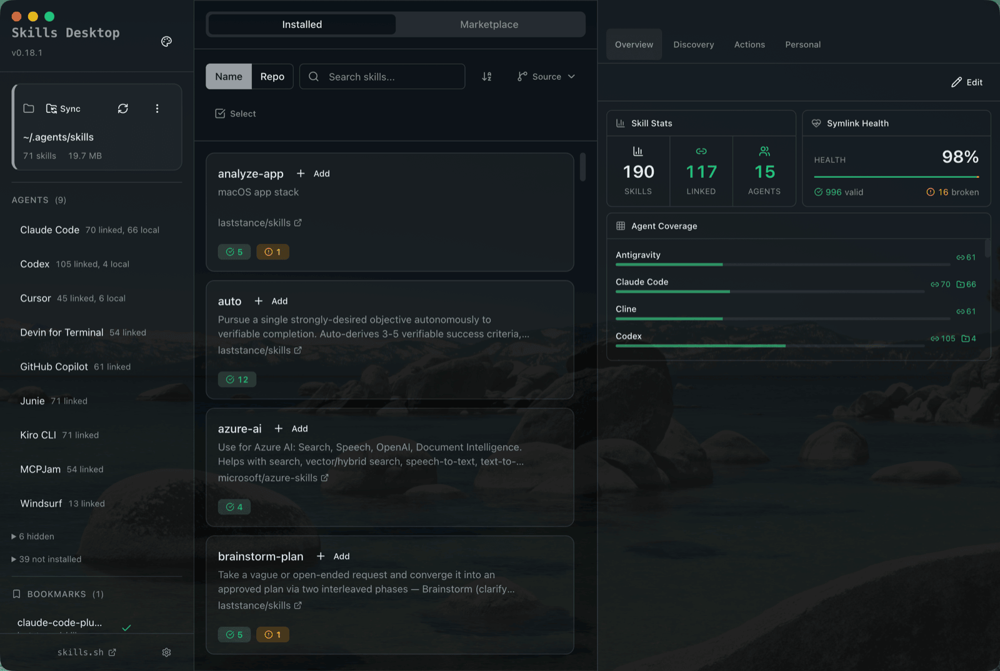

# Skills Desktop

> Visualize installed Skills and symlink status across AI agents

[](https://github.com/laststance/skills-desktop/actions/workflows/test.yml)
[](https://github.com/laststance/skills-desktop/actions/workflows/build.yml)
[](https://github.com/laststance/skills-desktop/actions/workflows/lint.yml)
[](https://github.com/laststance/skills-desktop/actions/workflows/e2e.yml)
[](https://github.com/laststance/skills-desktop/actions/workflows/fallow.yml)
[](https://github.com/laststance/skills-desktop/actions/workflows/security.yml)
[](https://github.com/laststance/skills-desktop/actions/workflows/socket.yml)
[](https://codecov.io/gh/laststance/skills-desktop)
[](https://scorecard.dev/viewer/?uri=github.com/laststance/skills-desktop)
[](LICENSE)
[](https://www.apple.com/macos/)
[](https://deepwiki.com/laststance/skills-desktop)

<p align="center">
  
</p>

Skills Desktop provides a GUI to manage and monitor skills installed via [`npx skills add <owner/repo>`](https://github.com/vercel-labs/skills). It displays the central skill repository (`~/.agents/skills/`) and shows symlink status for each supported AI agent.

## Features

- **75 AI Agents Supported** - Auto-detects Claude Code, Cursor, Codex, Gemini CLI, and more
- **Symlink Status Visualization** - Valid (✓), Broken (◐), Inaccessible (!), Missing (○) indicators
- **Customizable Dashboard** - Widget-based home view with skill stats, symlink health, agent coverage, bookmarks, and quick actions — drag, resize, and arrange across multiple pages
- **54 Themes** - 34 OKLCH color themes (17 hues × light/dark) + 2 pure neutral + 18 tinted neutral
- **Background Opacity** - In Settings → Appearance, choose Entire or Section and adjust backgrounds from 0–100% while text and icons stay solid. Reset restores 100%; each mode keeps its own values. See the [opacity behavior](DESIGN.md#window-opacity) and [settings contract](SPEC.md#settings-window).
- **Background Gallery** - In Settings → Appearance → Choose background, choose from four [bundled photos](apps/desktop/resources/backgrounds/README.md), upload your own image, crop it, and apply Fill / Fit / Tile. Built-in photos and uploads work offline. Online Unsplash browsing requires [provider configuration](apps/website/README.md); see the [verification record](docs/qa/background-gallery.md).
- **Auto Update** - Automatic updates via GitHub Releases

## Supported Agents

| Agent            | Path                          |
| ---------------- | ----------------------------- |
| Claude Code      | `~/.claude/skills/`           |
| Cursor           | `~/.cursor/skills/`           |
| OpenAI Codex     | `~/.codex/skills/`            |
| Gemini CLI       | `~/.gemini/skills/`           |
| GitHub Copilot   | `~/.copilot/skills/`          |
| Cline            | `~/.cline/skills/`            |
| Roo Code         | `~/.roo/skills/`              |
| Junie            | `~/.junie/skills/`            |
| Devin Desktop    | `~/.codeium/windsurf/skills/` |
| OpenCode         | `~/.config/opencode/skills/`  |
| Continue         | `~/.continue/skills/`         |
| _...and 64 more_ |                               |

## Installation

Download the latest release from [GitHub Releases](https://github.com/laststance/skills-desktop/releases).

| Architecture             | Download                         |
| ------------------------ | -------------------------------- |
| Apple Silicon (M1/M2/M3) | `skills-desktop-x.x.x-arm64.dmg` |
| Intel Mac                | `skills-desktop-x.x.x-x64.dmg`   |

## Security

Please report vulnerabilities through the process described in
[SECURITY.md](SECURITY.md), not through public issues.

Skills Desktop keeps local filesystem access behind Electron preload IPC. The
main and settings windows use sandboxed, context-isolated renderers with Node.js
integration disabled. Main-process handlers validate IPC arguments, restrict
file reads to known skills directories, restrict external links to http(s), and
allow marketplace webviews only from the expected skills.sh origin.

macOS releases are built with Developer ID signing, notarization, and the
hardened runtime enabled. The security posture tracked for
[issue #241](https://github.com/laststance/skills-desktop/issues/241) includes
CodeQL, dependency review, production dependency audit, Socket dependency
scanning, OpenSSF Scorecard, GitHub secret scanning, Dependabot security
updates, SHA-pinned least-privilege Actions, and branch protection.

## Development

### Prerequisites

- macOS (the app and its E2E suite are macOS-only)
- Node.js 24 (the exact version is pinned in [`.node-version`](.node-version))
- pnpm, pinned by the `packageManager` field (`corepack enable` or [pnpm/setup](https://pnpm.io/installation))

### Setup

```bash
# Install every workspace package from the single root lockfile
pnpm install --frozen-lockfile

# Start development
pnpm dev

# Type check
pnpm typecheck

# Lint
pnpm lint
```

### Testing

```bash
# Unit + browser tests (Vitest)
pnpm test

# Full fast gate, including Website and Electron bridge checks
pnpm validate

# E2E tests (Playwright Electron, macOS only)
# Run only after pnpm validate succeeds
pnpm test:e2e
```

| Suite | Command         | Runner                                                                     |
| ----- | --------------- | -------------------------------------------------------------------------- |
| Unit  | `pnpm test`     | Vitest (Node + browser mode via `*.browser.test.tsx`)                      |
| E2E   | `pnpm test:e2e` | Playwright Electron — boots the real app per spec, isolated HOME each test |

E2E specs live in `apps/desktop/e2e/spec/*.e2e.ts`. The suite uses `cp -al` hardlink snapshots so each test starts from a fresh, populated `~/.agents/skills/` without re-running the skills CLI installer (~50 ms reset). CI runs on `macos-latest` (`.github/workflows/e2e.yml`); failures upload `playwright-report/` and `test-results/` as artifacts (traces + videos retained on failure).

> **⚠️ Hardlink caveat for spec authors.** Hardlinked files share inodes
> across every working HOME, so in-place edits (`writeFileSync` over an
> existing `SKILL.md`, `appendFileSync`, etc.) corrupt the snapshot for
> every subsequent test. Safe ops only: `unlink`, `rmdir`, `mkdir` +
> `writeFile` of NEW paths. See `apps/desktop/e2e/fixtures/isolated-home.ts:82-85`
> for the canonical safe-ops list.

### Build

```bash
# Build for macOS (requires code signing)
APPLE_KEYCHAIN_PROFILE=skills-desktop pnpm build:mac

# Verify gallery assets, Sharp, upload ownership and CSP in both built packages
# (bundle paths are relative to apps/desktop, where electron-builder writes dist/)
pnpm test:packaged:backgrounds -- --arm64 'dist/mac-arm64/Skills Desktop.app' --x64 'dist/mac/Skills Desktop.app' --output /tmp/backgrounds.json

# Verify that the packaged window reaches the native compositor (requires Screen Recording)
pnpm test:release:macos-window
```

## Tech Stack

| Component | Technology                                           |
| --------- | ---------------------------------------------------- |
| Framework | Electron 44                                          |
| Frontend  | React 19 + TypeScript                                |
| State     | Redux Toolkit + @laststance/redux-storage-middleware |
| Styling   | Tailwind CSS + shadcn/ui                             |
| Build     | electron-vite                                        |

## Project Structure

A pnpm workspace with one lockfile. Dependencies used by more than one package
are declared once in the `catalog:` of [`pnpm-workspace.yaml`](pnpm-workspace.yaml),
and [sherif](https://github.com/QuiiBz/sherif) fails CI on version drift.

```
apps/
├── desktop/                 # Electron app (package name: skills-desktop)
│   ├── src/main/            #   Electron main process
│   ├── src/preload/         #   Context bridge (IPC)
│   ├── src/renderer/        #   React frontend
│   ├── src/shared/          #   Types and constants shared across processes
│   └── e2e/                 #   Playwright Electron suite
└── website/                 # Next.js site + Unsplash oRPC proxy (Vercel)
packages/
└── unsplash-contract/       # oRPC contract and limits shared by desktop and website
```

See [ARCHITECTURE.md](ARCHITECTURE.md) for how the pieces fit together.

## Contributing

Contributions are welcome. Read [CONTRIBUTING.md](CONTRIBUTING.md) for setup,
the quality gates and the pull request checklist, and follow the
[Code of Conduct](CODE_OF_CONDUCT.md). Report vulnerabilities privately as
described in [SECURITY.md](SECURITY.md).

Every pull request runs these workflows: [Test](.github/workflows/test.yml),
[Build](.github/workflows/build.yml), [TypeCheck](.github/workflows/typecheck.yml),
[Lint](.github/workflows/lint.yml), [Format](.github/workflows/format.yml),
[Fallow](.github/workflows/fallow.yml), [E2E](.github/workflows/e2e.yml),
[Security](.github/workflows/security.yml) and [Socket](.github/workflows/socket.yml).
[Scorecard](.github/workflows/scorecard.yml) runs on `main`. Socket uses the
`SOCKET_SECURITY_API_TOKEN` secret and skips pull requests from forks.

## Related

- [Changelog](CHANGELOG.md) - Changes planned for the next release
- [Skills CLI](https://github.com/vercel-labs/skills) - Install skills via CLI
- [Skills Registry](https://skills.sh) - Browse available skills
- [Skills宝](https://skilery.com) - Chinese search and install hub for skills
- [Agent Skills Spec](https://agentskills.io) - Skills specification

## License

[MIT](LICENSE) © [Laststance.io](https://github.com/laststance)
