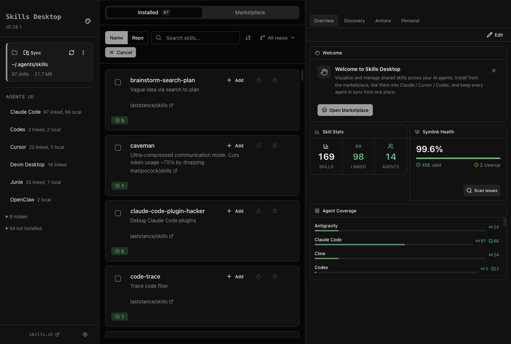
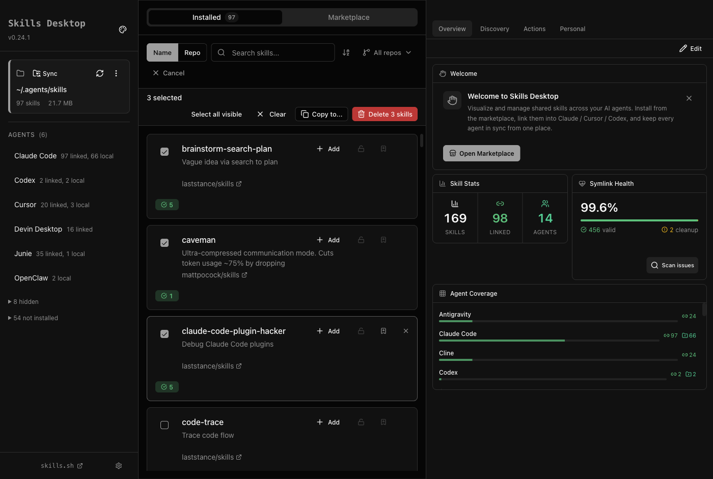
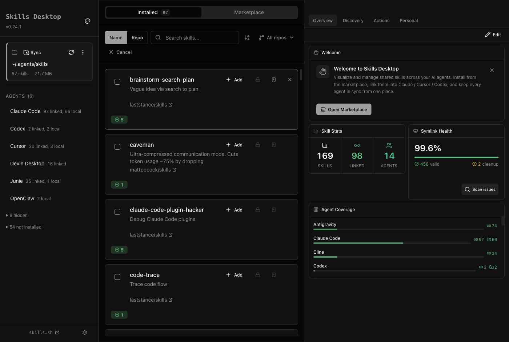
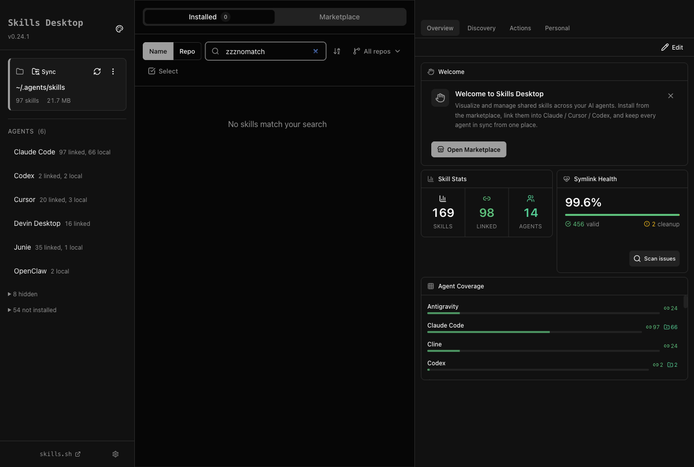

# UX Gap Report: Skills Desktop — Data Management (Search & Select-All Operability)

**Date**: 2026-06-17
**Target**: Electron app via CDP at `localhost:9222`
**Category**: Data Management — Search box & select-all operability
**Session**: Attached via playwright-cli CDP

## Overall Score: 63/100

| Dimension            | Score | Verdict    |
| -------------------- | ----- | ---------- |
| Typography & Spacing | 20/25 | Good       |
| Interactive States   | 12/25 | Critical   |
| Content Hierarchy    | 14/25 | Needs Work |
| Loading & Error UX   | 17/25 | Needs Work |

---

## Critical Gaps

### 1. Select All Affordance Hidden Until First Manual Selection (Interactive States: 12/25)

**Root cause** (`SelectionToolbar.tsx:102`):

```tsx
if (!bulkSelectMode || selectedCount === 0) return null
```

The toolbar — including the "Select all visible" button — renders only when at least one item is already selected. This creates a **discoverability trap**: users entering bulk mode see empty checkboxes with no way to bulk-select without first manually clicking one.

**What Linear/Notion/Codex do**: A "Select All" affordance is present from the moment bulk mode is entered — either as a header-level checkbox that transitions to indeterminate/checked state, or a visible button in the zero-selection toolbar state. Users immediately understand the available action surface.

**Your app**:

- Bulk mode entered (0 selected): toolbar hidden entirely
  
- After manually ticking 1 checkbox: "Select all visible" finally appears
  

**Gap**: "Select all visible" is invisible at the one moment users need it most — when they want to quickly select everything.

**Fix options** (in increasing implementation cost):

1. **(Easiest)** Render the toolbar when `bulkSelectMode && selectedCount === 0`, showing only "Select all visible" and disabling the destructive action:
   ```tsx
   // SelectionToolbar.tsx — change the early-return guard
   if (!bulkSelectMode) return null
   // selectedCount === 0 no longer returns null — show zero-selection toolbar state
   ```
2. Add a header-row checkbox above the skills list that acts as a "select all" toggle (indeterminate when some selected, checked when all selected).
3. Show a subtle "Select all" ghost button inline with the "Cancel" button in the action bar when 0 items are selected.

---

## Moderate Gaps

### 2. Cmd+A Select-All Silently Fails When Search Box Has Focus (Interactive States: 12/25)

**Root cause** (`MainContent.tsx:491-517`):

```tsx
const handleKey = (event: KeyboardEvent): void => {
  if (isEditableTarget(document.activeElement)) return  // ← blocks when search is focused
  ...
  if ((event.metaKey || event.ctrlKey) && event.key.toLowerCase() === 'a') {
    dispatch(selectAll(visibleNamesRef.current))
  }
}
```

`isEditableTarget` correctly returns early when an `<input>` is focused — this prevents select-all from stealing the user's text selection. However, the expected workflow is:

1. User types a search query (search box focused)
2. Results filter to N skills
3. User presses `Cmd+A` to select all filtered results
4. **Nothing happens** — browser selects the text in the search box instead

No feedback tells the user why, or that they must click outside the search box first.

**What top-tier apps do**: Warp and Linear handle this by blurring the focused input and then triggering the bulk-select, or by showing a keyboard shortcut hint (tooltip or command palette entry) so users know the precondition.

**Your app**:

- After pressing `Cmd+A` in bulk mode while search box was focused: no items selected
  

**Fix options**:

1. **(Easiest)** In the `Cmd+A` branch, if focus is on the search input, blur it and dispatch select-all:
   ```tsx
   if ((event.metaKey || event.ctrlKey) && event.key.toLowerCase() === 'a') {
     if (isEditableTarget(document.activeElement)) {
       ;(document.activeElement as HTMLElement).blur()
     }
     event.preventDefault()
     dispatch(selectAll(visibleNamesRef.current))
     return
   }
   ```
2. Add a tooltip to the "Select all visible" button: `⌘A` shortcut hint.
3. Show a keyboard shortcut legend in the bulk mode toolbar (e.g., `⌘A to select all • Esc to clear • Esc again to exit`).

---

### 3. Search Empty State Lacks Visual Treatment (Content Hierarchy: 14/25)

**Root cause** (`SkillsList.tsx:143-148`, `skillsListHelpers.ts:152`):

```tsx
if (filteredSkills.length === 0) {
  return (
    <div className="flex items-center justify-center py-12">
      <div className="text-muted-foreground">{emptyMessage}</div>
    </div>
  )
}
```

The "No skills installed" state (line 121) has full treatment: centered layout, `text-lg font-medium` headline, supporting copy, and a `<code>` install hint. The search empty state is plain muted text with no icon, no CTA.

**What Notion/Linear do**: A search empty state includes an icon (e.g., a search glass with an X), the query echoed ("No results for "cave""), and a "Clear search" action link. This gives the user a path forward without hunting for the clear button.

**Your app**:

- "zzznomatch" typed, result: plain gray text with no affordance
  

**Fix**:

```tsx
// skillsListHelpers.ts — make getEmptyListMessage return JSX or extract a component
// SkillsList.tsx — promote the search empty state to a proper component:
if (filteredSkills.length === 0 && searchQuery.length > 0) {
  return (
    <div className="flex flex-col items-center justify-center py-12 text-center gap-3">
      <SearchX
        className="h-8 w-8 text-muted-foreground/40"
        aria-hidden="true"
      />
      <p className="text-sm text-muted-foreground">
        No skills match &ldquo;{searchQuery}&rdquo;
      </p>
      <Button
        variant="ghost"
        size="sm"
        onClick={() => dispatch(setSearchQuery(''))}
      >
        Clear search
      </Button>
    </div>
  )
}
```

Note: `getEmptyListMessage` would need to be split into a component or the condition should be handled separately from other empty-state contexts (agent filter, type filter).

---

### 4. No Keyboard Shortcut Discoverability in Bulk Mode (Interactive States: 12/25)

**Observation**: `Cmd+A` and `Escape` shortcuts exist and work, but there is no visible hint in the UI. Users who have never read documentation will never discover them.

**What Raycast/Warp do**: Keyboard shortcuts are surfaced on hover via tooltips (`title` or Radix Tooltip) and in empty states. The "Select all visible" button could show `⌘A` as a kbd badge.

**Fix**:
Add tooltip hints to the toolbar buttons:

```tsx
// SelectionToolbar.tsx
<Button ... title="Select all visible (⌘A)">Select all visible</Button>
<Button ... title="Clear selection (Esc)">Clear</Button>
```

Or use a subtle badge:

```tsx
<Button ...>
  Select all visible
  <kbd className="ml-1.5 text-[10px] font-mono opacity-60 bg-muted px-1 rounded">⌘A</kbd>
</Button>
```

---

## Strengths

- **`Cmd+F` / `/` focus shortcuts work**: pressing either key focuses the search box from any non-editable state ✅
- **Live search filtering**: results update on every keystroke with correct count ✅
- **Clear (`×`) button**: appears when text is entered, one click to clear ✅
- **Bulk mode entry/exit**: "Cancel" button cleanly exits bulk mode ✅
- **Tab count updates during search**: the "Installed 97" tab badge updates to show filtered count ✅
- **"Select all visible" is accurate**: correctly selects only the currently visible (filtered) subset ✅
- **2-step Escape pattern**: first Esc clears selection, second Esc exits bulk mode — matches Gmail's safety pattern ✅
- **Toolbar layout wraps gracefully**: at narrow widths the action cluster wraps as a cohesive group ✅

---

## Recommendations Summary

| Priority | Gap                                                                        | Effort                                            |
| -------- | -------------------------------------------------------------------------- | ------------------------------------------------- |
| Critical | SelectionToolbar hidden at 0 selections — no select-all at bulk mode entry | S (1 line guard change + optional zero-state UI)  |
| Moderate | Cmd+A silently blocked when search box focused — no feedback               | S (blur-then-select in handler)                   |
| Moderate | Search empty state: text-only, no icon, no CTA                             | M (new component + split from other empty states) |
| Moderate | Keyboard shortcut hints not discoverable                                   | XS (tooltip title attributes)                     |

---

## Screenshots Index

| File                           | State                                                                 |
| ------------------------------ | --------------------------------------------------------------------- |
| `installed-initial.png`        | App initial state, Installed tab                                      |
| `installed-search-focused.png` | Search box clicked (focus-visible ring via keyboard only)             |
| `installed-search-empty.png`   | Search "zzznomatch" — no results empty state                          |
| `installed-bulk-0selected.png` | Bulk mode entered, 0 items selected — toolbar hidden                  |
| `installed-bulk-cmd-a.png`     | Cmd+A pressed while search box focused — no effect                    |
| `installed-bulk-3selected.png` | 3 items manually selected — toolbar with "Select all visible" appears |
