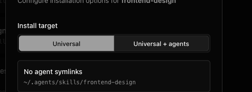
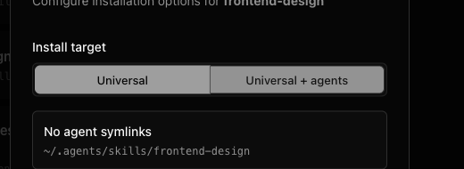

# Visual-Lint Report: Skills Desktop — Marketplace Install Target

| Field           | Value                                                                                                                              |
| --------------- | ---------------------------------------------------------------------------------------------------------------------------------- |
| Date            | 2026-06-11                                                                                                                         |
| App             | Skills Desktop                                                                                                                     |
| Scope           | Marketplace Install target selector                                                                                                |
| Mode            | project-aware (DESIGN.md found)                                                                                                    |
| Design source   | ./DESIGN.md                                                                                                                        |
| Executor        | lightweight inline                                                                                                                 |
| Capture         | Electron CDP :9222 · 1x CSS via playwright-cli (scale:css; DPR-2 render)                                                           |
| States captured | 6 (marketplace loading, marketplace loaded, install modal default, Universal-only, Universal-only hover, agent-list scroll-bottom) |
| Screenshots     | 7                                                                                                                                  |

## Summary

1 finding: 0 readability-breaking (sev 3), 1 clearly-wrong but usable (sev 2), 0 cosmetic-only (sev 1). Most severe: the hovered unselected Install target segment looks visually selected at the same time as the actual selected segment.

**This is a read-only diagnostic. No source was edited and nothing was committed.**

---

## Resolution Proof

Fixed after the diagnostic by making the shared `outline` ToggleGroup hover state muted while selected items keep their `data-state="on"` accent surface. Source edits are outside the read-only `/visual-lint` pass.

**evidence:** 

---

## Severity 2 — clearly wrong but usable

### VL-001: Install target hover state matches selected state

- **element:** "Universal" and "Universal + agents" in the Install target segmented control, center Install Skill dialog.
- **defect:** Hovering the unselected "Universal + agents" segment gives it the same bright selected-looking surface as the selected "Universal" segment.
- **expected_vs_actual:** Expected the selected segment to remain clearly stronger than hover, with hover reading as transient feedback; actual has both segments filled almost identically, making the current mode ambiguous at a glance.
- **severity:** 2
- **confidence:** high
- **rubric:** F2 hover/focus state clarity; F7 selected-vs-unselected state clarity; DESIGN.md Tabs and Segmented Controls requires subtle, stable selection communication.
- **state:** Universal-only hover
- **evidence:** 

---

## Needs confirmation (low confidence — not asserted)

- **VL-002 (low):** Possible Marketplace right-rail stale loading state: `marketplace-default-loaded.png` still shows "Loading trending skills..." after the list is loaded. This is not counted because the screenshot alone cannot distinguish a slow async request from a visual defect, and it is outside the Install target selector scope.

---

## Coverage

Per `anti-false-positive.md` rule 7 — enumerate, don't fill a quota. For each captured state, the categories walked and cleared:

| State                    | A text  | B containment | C align | D size  | E color | F state    |
| ------------------------ | ------- | ------------- | ------- | ------- | ------- | ---------- |
| marketplace loading      | ✓ clear | ✓ clear       | ✓ clear | ✓ clear | ✓ clear | n/a        |
| marketplace loaded       | ✓ clear | ✓ clear       | ✓ clear | ✓ clear | ✓ clear | n/a        |
| install modal default    | ✓ clear | ✓ clear       | ✓ clear | ✓ clear | ✓ clear | ✓ clear    |
| Universal-only           | ✓ clear | ✓ clear       | ✓ clear | ✓ clear | ✓ clear | ✓ clear    |
| Universal-only hover     | ✓ clear | ✓ clear       | ✓ clear | ✓ clear | ✓ clear | **VL-001** |
| agent-list scroll-bottom | ✓ clear | ✓ clear       | ✓ clear | ✓ clear | ✓ clear | ✓ clear    |

---

_Generated by `/visual-lint` v0.1.1 (pure-VLM, read-only). To fix these findings, hand this report to a session with access to the source tree — visual-lint reports, it does not fix._
